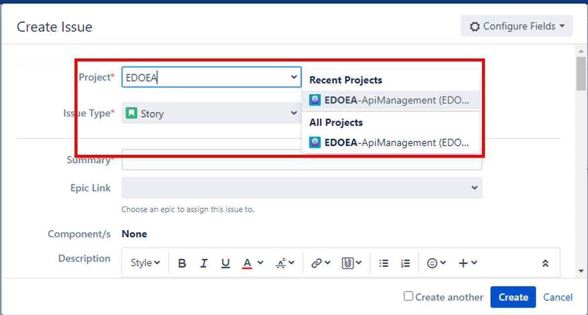
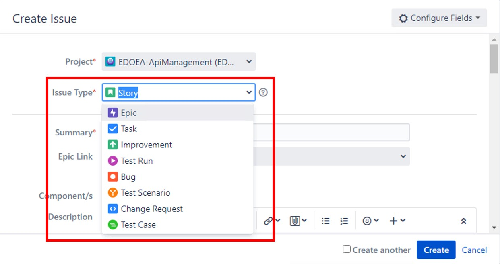
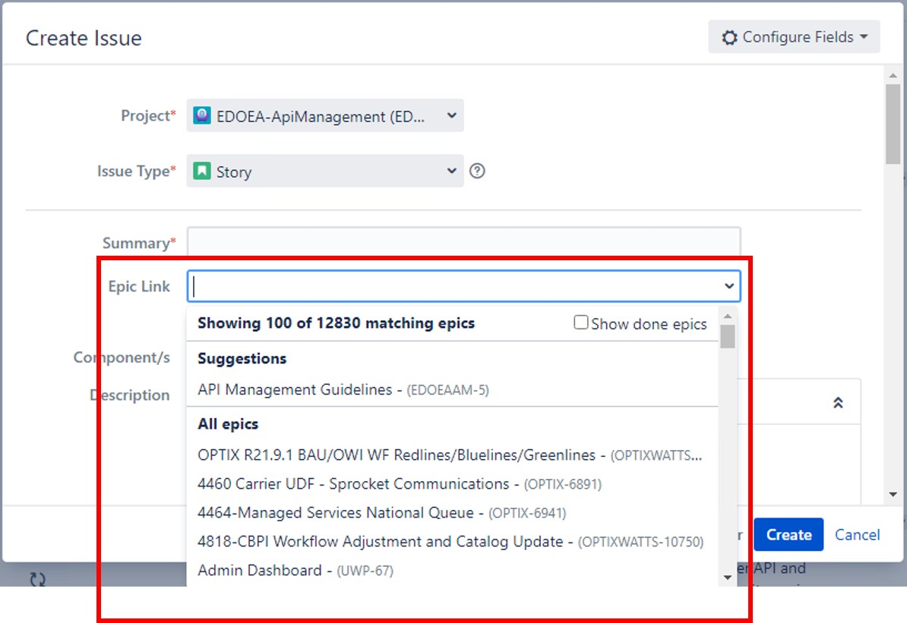
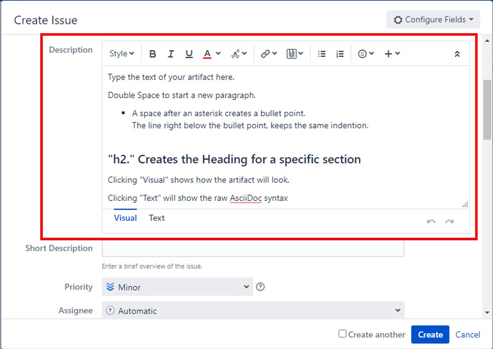
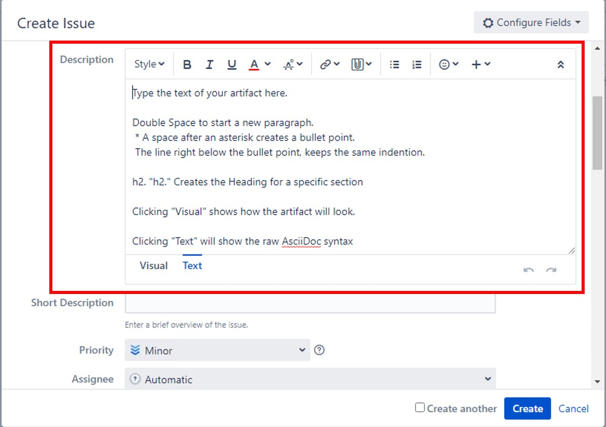
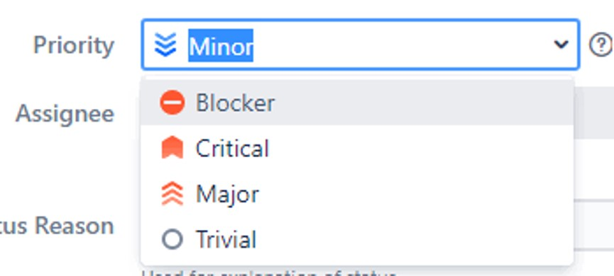
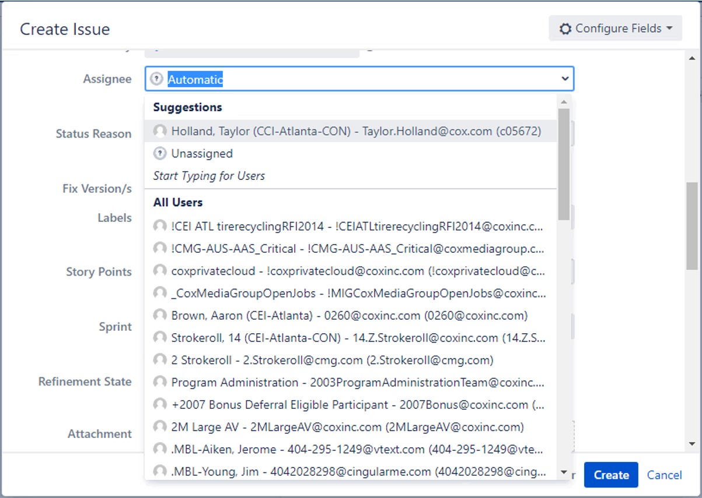

## Open a JIRA

You will start by going to https://jira.cox.com[JIRA].

image::images/JIRA Startup.jpg[JIRA Startup]

. Click on Projects dropdown and select View All Projects
+
image::images/JIRA View Projects.jpg[View Projects]

. Type EDOEA into the search box and click EDOEA-ApiManagement
+
image::images/JIRA Search.jpg[JIRA Search]

. Select the issue you would like to contribute to OR Create a new issue
+
image::images/Open Issues.jpg[Open Issues]

.. To create a new issue:
+
image::images/Create Issue.jpg[Create Issue]

... Select EDOEA-ApiManagement as the Project. +
+

... Select the Issue Type:
+
* Story
* Epic
* Task
* Improvement
* Test Run
* Bug
* Test Scenario
* Change Request
* Test Case
+

... Write a summary
+
image::images/Create Issue 2.jpg[Summary]

... If there is an associated Epic to assign the issue to, select the correct Epic Link.
+

... Write your description in Asciidoctor format. This allows the content to be run through the tool-chain and turned into an artifact.
+

... Select the appropriate Priority:
+
* Blocker
* Critical
* Major
* Minor
* Trivial
+

... Assign the issue to a teammate or yourself by typing in the person's name
+

... Provide label(s):
+
 * Suggestion
 * Requirement
 * Open Question
 * Template
+
image::images/Create Issue 3.jpg[Label]

... Click Create to save it
+
image::images/Create Issue 4.jpg[Create]
