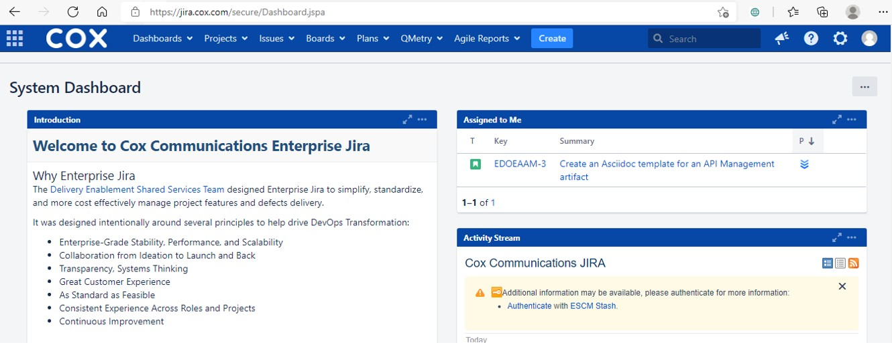
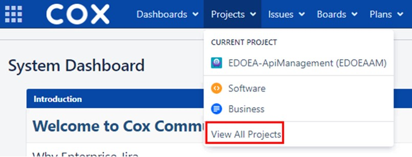
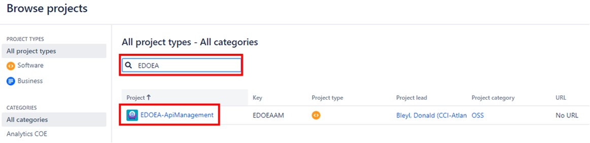
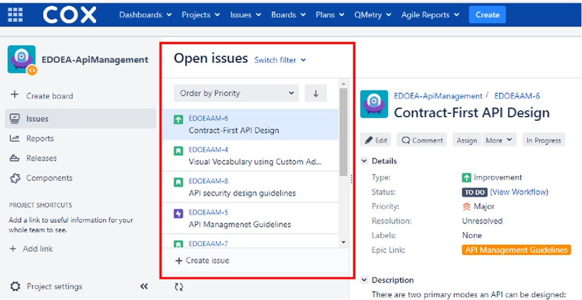
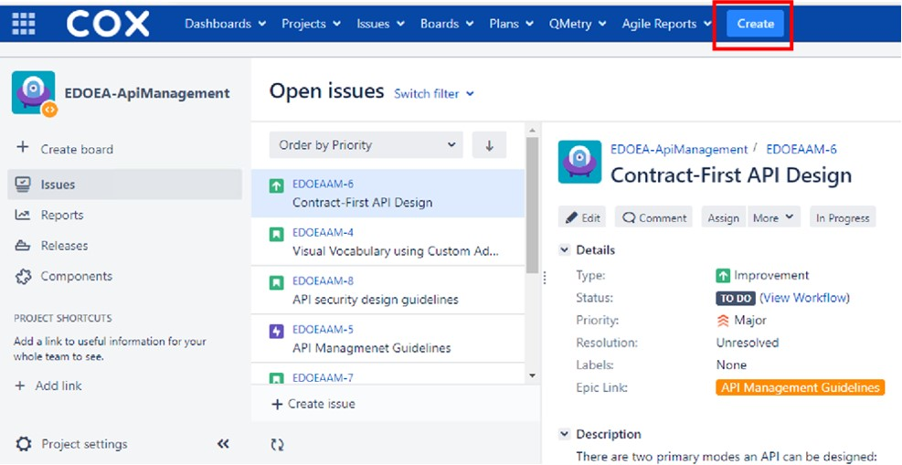
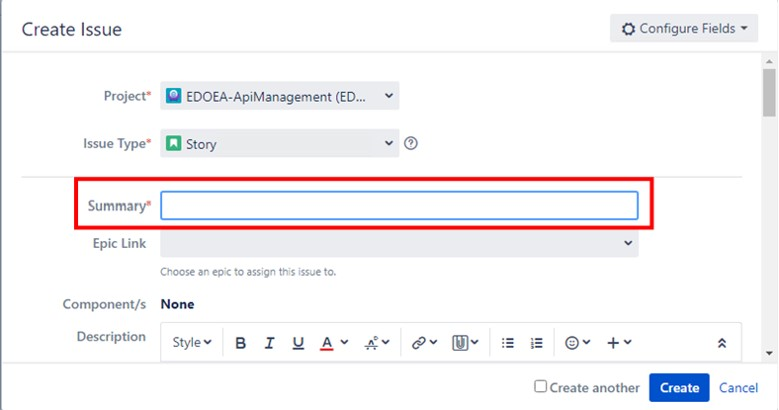
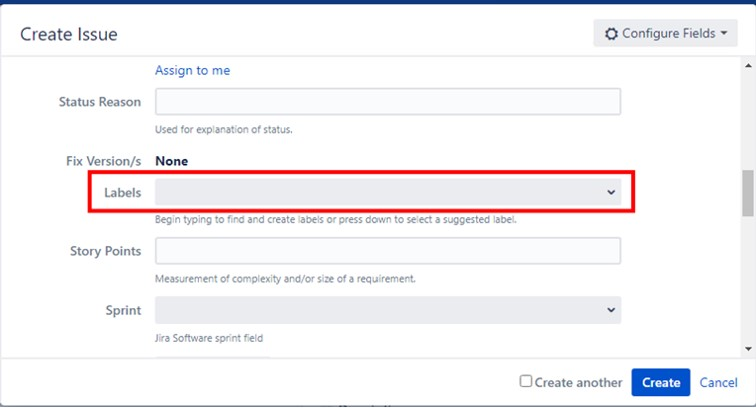
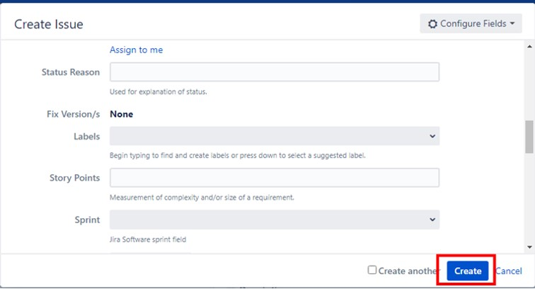

## Open a JIRA

You will start by going to https://jira.cox.com[JIRA].

Step 1: Click on Projects dropdown and select View All Projects

Step 2: Type EDOEA into the search box and click EDOEA-ApiManagement

Step 3: Select the issue you would like to contribute to OR Create a new issue

.. To create a new issue:

... Write a summary

.ii. Provide label(s):
 * Suggestion
 * Requirement
 * Open Question
 * Template
 

 
iii. Click Create to save it

